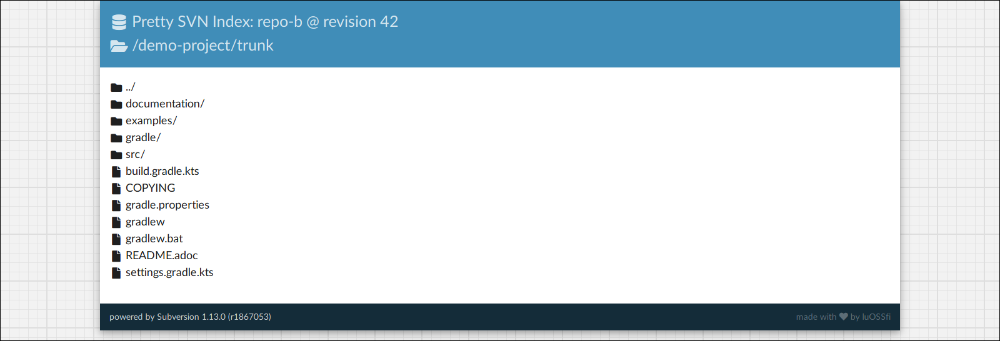

= Pretty SVN Index

Pretty SVN Index is a good-looking theme for SVN indexes generated by mod_dav_svn.

== Usage

=== Prerequisites

* Java JDK 8 or newer
* https://sass-lang.com/dart-sass[Dart Sass]

=== Build

. clone this repository
. go to the directory into which this repository has been cloned in the previous step
. run `$ ./gradlew assembleDist`
. transfer one of the archives under `build/distributions/` to your SVN server, extract the archive and place the resulting directory's content into the document root of your SVN serving Apache HTTP Server
. configure mod_dav_svn to use Pretty SVN Index:
+
.httpd.conf (example)
----
<Location /svn>
  DAV svn
  # [...]
  # use Pretty SVN Index for displaying the SVN repository via a web browser
  SVNIndexXSLT /pretty-svn-index.xsl
  # [...]
</Location>
----

. restart the Apache HTTP Server

The following options are available for the build:

* `--Psass.debug`: compile into non-minimized CSS with embedded source maps
* `--Psass.executable=<path to Sass executable>`: pass the location of the Sass executable to use to the build script

=== Style Customization

Pretty SVN Index supports customizing its style via variables.
To do so, go to directory `src/scss/` and add a new file named `pretty-svn-index-customized.scss` and load the `pretty-svn-index` module into it:

.src/scss/pretty-svn-index-customized.scss (example)
[code,scss]
----
@use "pretty-svn-index" with (
  $title-background-color: #44a100,
  $title-text-color: rgba(0,28,87,0.9),
);
----

The following table lists all available variables and their type:

[cols="4,1,11"]
|===
|Variable|Type|Description

|`background-color`|color|The color of the background outside the content page.
|`graph-paper-background`|boolean|Whether the background shall look like a sheet of graph paper.
|`graph-paper-line-color`|color|The color of the graph paper's lines (only useful if `graph-paper-background = true`).
|`header-background-color`|color|The color of the page header's background.
|`header-text-color`|color|The color of the content page header's text.
|`page-background-color`|color|The color of the content page's background.
|`page-shadow-color`|color|The color of the content page's shadow.
|`page-text-color`|color|The color of the content page's text.
|`footer-background-color`|color|The color of the page footer's background.
|`footer-text-color`|color|The color of the page footer's text.
|===

== Acknowledgments

Pretty SVN Index wouldn't be half as good without the beautiful http://www.latofonts.com[Lato font ^]family^, and the awesome icon set https://fontawesome.com[Font Awesome^].
The styling works would also have been much less enjoyable if it wasn't for the great https://sass-lang.com[Sass CSS extension language^].
